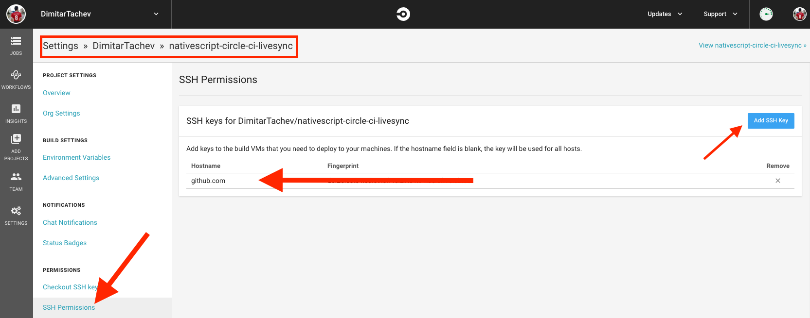
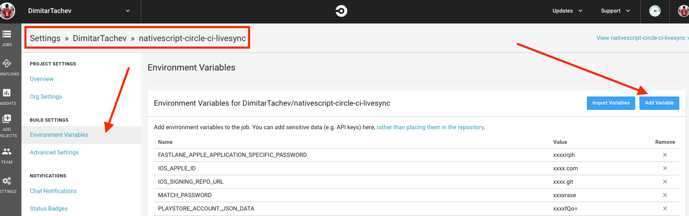

# NativeScript remote builds with Circle CI 


The Circle CI remote enables [Fastlane](https://fastlane.tools/) based remote builds in [CircleCI virtual machines](https://circleci.com/). 


## Prerequisites


* NativeScript 6.4.0 or higher.
* A [CircleCI account](https://circleci.com/) as this remote is based on Circle CI virtual machines.

> NOTE: If you are building an open source app, you could apply for [free CircleCI iOS builds](https://circleci.com/open-source). 

* A [Personal API Token for your Circle CI account](https://circleci.com/account/api) (you have to be logged-in in Circle CI in order to see this page). It will be used for the communication between your local machined and the Circle CI services for managing environment variables and getting the read status.

> NOTE: You have to be logged-in in Circle CI in order to see the [Circle CI Personal API Tokens page](https://circleci.com/account/api), 

* An **SSH key without password** [configured in your GitHub user settings](https://help.github.com/en/github/authenticating-to-github/adding-a-new-ssh-key-to-your-github-account).

## Basic Setup

In order to get started with Circle CI based builds, you need a GitHub repository for syncing your local app state with the Circle CI virtual machines. In this repository, the plugin will create a **temporary branch for each build operation** named `circle-ci{{uniqueBuildId}}` and **will not affect the existing branches**. The repository could be either the **app repository itself** or **any other GitHub repository** and should be specified in the `circleci.sshRepositoryURL` or `circleci.httpsRepositoryURL` properties of your `.nsremote.config.json`.

For example:

*{{your-app-root}}/.nsremote.config.json*

```
{
    "circleci": {
        "httpsRepositoryURL": "{{an HTTPS GitHub repository url}}"
    }
}
```

> NOTE: When using the HTTPS URL, you should also [set the `GITHUB_ACCESS_TOKEN` Local Environment Variable](#set-local-environment-variable).

or

*{{your-app-root}}/.nsremote.config.json*

```
{
    "circleci": {
        "sshRepositoryURL": "{{an SSH GitHub repository url}}"
    }
}
```

> NOTE: When using the SSH URL, you should have an SSH key with a write access configured on your local machine. 

> WARNING: This sync repository be used to sync your local code changes with the Circle CI virtual machines. **If the specified repository is public, make sure that your app does NOT have any sensitive data (e.g. secrets) which are not git ignored**.  

Once you setup the sync repository, you just need to set the `CIRCLE_CI_API_ACCESS_TOKEN` environment variable on your **local machine**. Take a look at the [Set Local Environment Variable](#set-local-environment-variable) section for more details.

## Android Builds Setup

No additional configurations needed. Just follow the [basic setup](#basic-setup).

## iOS Builds Setup

In order to get started with the Fastlane based Circle CI iOS build, you will need **an onetime access to a macOS machine and an administration access to a paid apple developer account**.

1) Follow the [basic setup](#basic-setup).
2) Get a macOS machine (you will need it only during this setup).
3) Download [Fastlane](https://fastlane.tools).
4) Setup the iOS signing in a **private GitHub repository** using the `fastlane match development` command and following the `Git Repository` flow. You could also run the `fastlane match appstore` if you plan to use the remote builds for production. You could read more about `fastlane match` features and its the iOS code signing management in the following article: https://docs.fastlane.tools/actions/match/.


> IMPORTANT: Remember the `appleId`, `signingRepositoryUrl` and the `match password` that you provide to the `fastlane match` commands as you will need them in the next step.


5) Set the `IOS_SIGNING_REPO_URL`, `IOS_APPLE_ID` and `MATCH_PASSWORD` **remote environment variables**. Take a look at the [Set Remote Environment Variable](#set-remote-environment-variable) section for more details.

6) Add a **private SSH key without password** for accessing the `{{IOS_SIGNING_REPO_URL}}` in the `SSH Permissions` settings page of your `sshRepositoryURL` CircleCI project as shown in the image below:




## Android Publish Setup

In order to get the Android Publishing working in the Fastlane based Circle CI builds, you will need to be the owner of a paid Google Play Account and follow the step below:

1) Follow the [basic setup](#basic-setup).
2) Follow the [Fastlane upload_to_play_store setup](https://docs.fastlane.tools/actions/upload_to_play_store/#setup).
3) Base64 encode the generated json file and set it to the `PLAYSTORE_ACCOUNT_BASE_64_JSON` **remote environment variable**. Take a look at the [Set Remote Environment Variable](#set-remote-environment-variable) section for more details.

## iOS Publish Setup

In order to setup the iOS publish in the Fastlane based Circle CI flow, you will need **an administration access to a paid apple developer account** and follow the steps below:
1) Visit appleid.apple.com/account/manage.
2) Login with the user specified in the `IOS_APPLE_ID` remote environment variable.
3) Generate a new application specific password.
4) Set the password to the `FASTLANE_APPLE_APPLICATION_SPECIFIC_PASSWORD` remote environment variable. Take a look at the [Set Remote Environment Variable](#set-remote-environment-variable) section for more details.
5) Visit appstoreconnect.apple.com
6) Copy the `apple_id` (should be something like `2457129416`) of the app you want to publish and set it to the `IOS_APPSTORE_CONNECT_APP_ID` remote environment variable. Take a look at the [Set Remote Environment Variable](#set-remote-environment-variable) section for more details.

## Set Local Environment Variable

The local environment variable can be set just like a regular environment variables on your local machine. However, if you don't wanna set environment variable on your local machine or you want to easily share the variables between multiple machines, the local environment variables could be also set in the `local` property of the git ignored `.nsremote.env.json` file. For example:
```
{
  "local": {
    "CIRCLE_CI_API_ACCESS_TOKEN": "{{the value of your Personal API Token mention in the prerequisites section above}}",
    "GITHUB_ACCESS_TOKEN": "{{the GitHub access token for accessing the HTTPS sync repo URL, skipped when using the sshRepositoryURL}}"
  },
  "remote": {}
}
```

## Set Remote Environment Variable

If you use the sync repository for just a single app, you could directly set the environment variables in its Circle CI project as shown in the image blow:


 
If you don't wanna set environment variable in the sync repository Circle CI project (e.g. if you want to reuse the same sync repository for multiple apps with different iOS code signing), the remote environment variables could be set/overridden at app level using the `remote` property of the git ignored `.nsremote.env.json` file. For example:

```
{
  "local": {},
  "remote": {
    "IOS_APPLE_ID": "{{the apple id used by the Fastlane commands}}",
    "IOS_SIGNING_REPO_URL": "{{the private github repository used in the fastlane match commands above}}",
    "MATCH_PASSWORD": "{{the match password set in the match commands above}}",
    "PLAYSTORE_ACCOUNT_BASE_64_JSON": "{{the base64 encoded JSON file generated from your play store account}}"
  }
}
```

## Security

The sensitive data is stored in environment variables in the Circle CI project (uploaded using `https` calls) and used directly from the variables. The iOS signing is managed by the `fastlane match` tool and stored encrypted in a private GitHub repository. The android `keystore` provided by `--key-store-path` is preprocessed by the plugin, base64 encoded and uploaded to the above-mentioned Circle CI environment variables.
